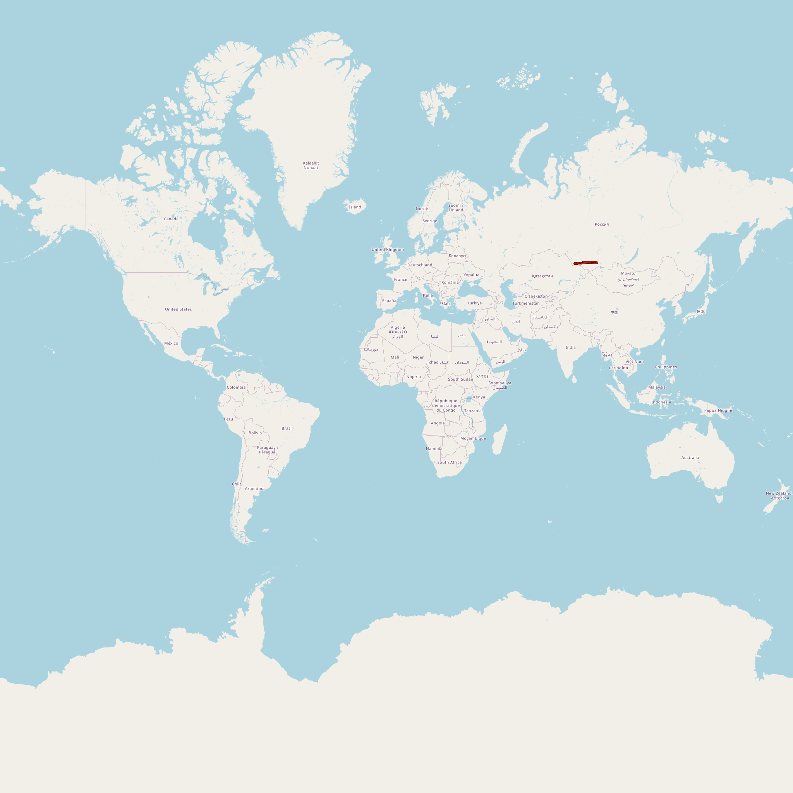
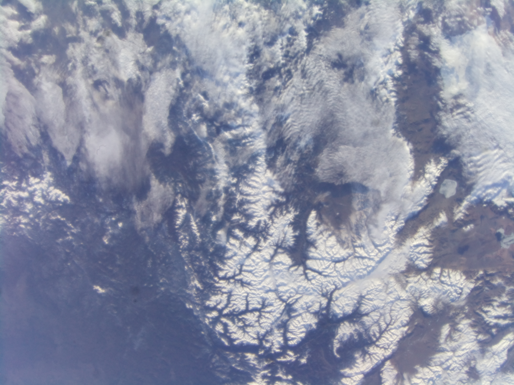
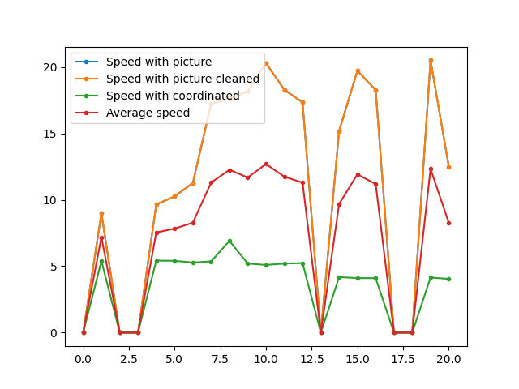
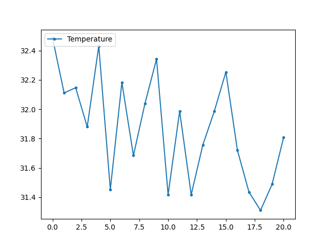
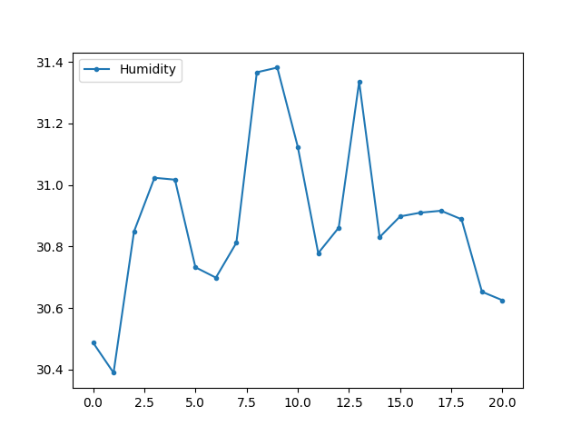
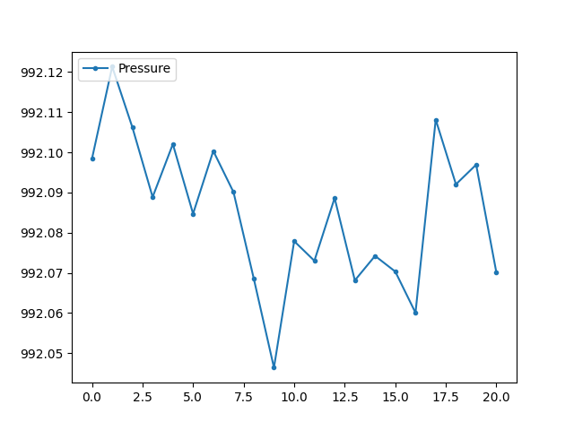

# 🛰️ ISS Mission Execution & Results Report

This document presents the actual telemetry, data logs, and visual outputs collected during the program's 10-minute execution window aboard the International Space Station (ISS).

---

## 📸 Captured Earth Imagery & Ground Track

During the flight run, the Raspberry Pi camera captured **42 sequential images** of Earth while simultaneously logging Exif GPS tags.

- **Tracking Map:** Position coordinates were mapped to track the ISS orbital path in real time.
- **Sample Capture:**

|                ISS Tracking Map                |          Sample Earth Capture          |
| :--------------------------------------------: | :------------------------------------: |
|  |  |

---

## ⚡ Speed Calculation Performance

The application calculated orbital velocity in real time using two distinct methods:

1. **Computer Vision (ORB Features):** Derived velocity by measuring feature displacement across consecutive frames.
2. **GPS Geodesic Delta:** Calculated velocity using Exif coordinate tags applied to the Haversine formula.

- **IQR Outlier Removal:** An Interquartile Range filter automatically sanitized noisy velocity spikes caused by uniform features (e.g., cloud cover or open ocean).
- **Final Computed Average Speed:** Stored in `result.txt` (approx. ~7.6 km/s).

---

## 🌡️ Telemetry & Environmental Metrics

The **Sense HAT** onboard module recorded environmental parameters and 9-DOF IMU data across all 42 iterations.

| Environmental Metric | Sensor Plot                                  | Summary                                                       |
| :------------------- | :------------------------------------------- | :------------------------------------------------------------ |
| **Temperature**      |  | Monitored internal flight unit heat dissipation over 10 min.  |
| **Humidity**         |        | Tracked ambient atmospheric conditions inside the ISS module. |
| **Pressure**         |        | Confirmed stable internal cabin pressure throughout the run.  |

---

## 📂 Execution Artifacts

The raw datasets generated during flight are preserved in the repository for review:

- `data/dataSpeed.csv`: Detailed frame-by-frame speed logs and loop execution times.
- `data/dataEnvironment.csv`: Temperature, pressure, and humidity time series.
- `data/dataIMU.csv`: Gyroscope, accelerometer, and magnetometer readings.
- `data/dataCoordinated.csv`: Latitude and longitude progression.
